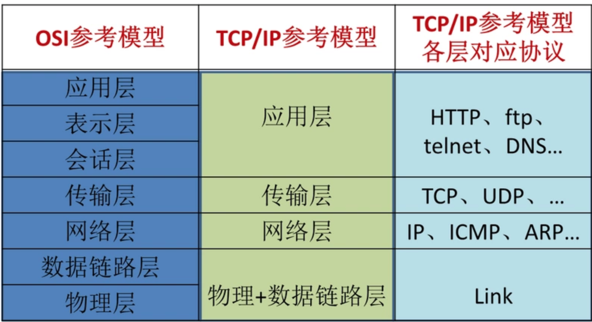

---
title:网络基础
tags: node
categories:
- node
- 网络编程
---

#### 网络分层

可以按照**OSI参考模型** 和**TCP/IP参考模型**进行分层，如下图所示：

#### 跨域

因为浏览器的同源策略，是网络请求时，如果协议，域名，端口任意一个不同都非同源。

#### JsonP

#### CORS

#### 代理

#### 

#### Proxy代理模式

#### Bodyparse

#### 上传文件

#### 下载文件

#### 爬虫

#### 实时通信

#### https

####http2

