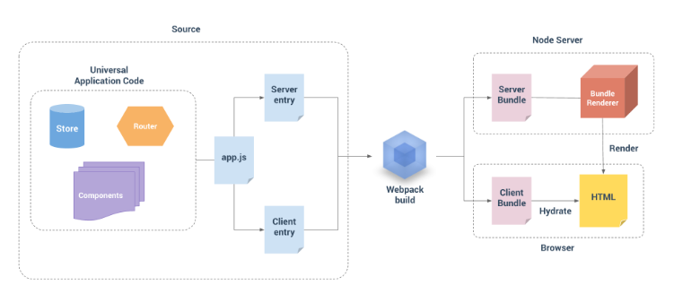
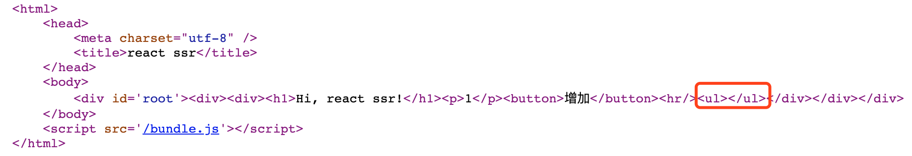
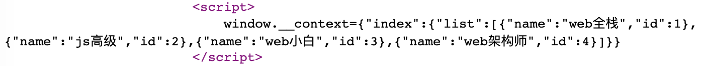

## 同构应用架构



1. Webpack将代码（component，store，router等）的入口(app.js)打包成Server bundle和Client bundle
2. Server bundle负责返回首页HTML（render html），此时不带js代码，只用于页面渲染
3. Client bundle负责处理逻辑的js代码(如负责事件点击)，**Hydrate(注入)**到服务端返回的html中

> react ssr同vue ssr有个区别是node本身不支持JSX，需要babel-loader的支持

## 实战 - 手写一个React SSR

### 新建工程

```javascript
mkdir react-ssr
npm init -y //初始化项目，加-y可以跳过需要所有确定步骤
```

### SSR编译环境搭建

#### 服务端环境

1. 新建server/index.js用于服务端代码的编写

2. 新建webpack.server.js

```javascript
const path = require('path')
// node环境中防止import时把node_modules引入编译
const nodeExternals = require('webpack-node-externals') 

// 服务端webpack
module.exports = {
    target: 'node', // 默认是web
    mode: 'development',
    entry: './server/index.js',
    externals: [nodeExternals()],
    output: {
        // 用patch.resolve处理成绝对路径
        path: path.resolve(__dirname, 'build'), 
        filename: 'bundle.js'
    },
    // babel
    module: {
        rules: [
            {
                test: /\.js$/,
                loader: 'babel-loader',
                exclude: /node_modules/,
                // 编译级别，@babel/preset-react支持JSX， @babel/preset-env支持ES6
                options: {
                    presets:['@babel/preset-react', ['@babel/preset-env']]
                }
            }
        ]
    }
}
```

### 客户端环境

1. 新建client/index.js用于客户端代码的编写
2. 新建webpack.client.js

```javascript
const path = require('path')

// 客户端webpack
module.exports = {
    mode: 'development',
    entry: './client/index.js',
    output: {
        path: path.resolve(__dirname, 'public'),
        filename: 'bundle.js'
    },
    // babel
    module: {
        rules: [
            {
                test: /\.js$/,
                loader: 'babel-loader',
                exclude: /node_modules/,
                // 编译级别
                options: {
                    presets:['@babel/preset-react', ['@babel/preset-env']]
                }
            }
        ]
    }
}
```

#### 安装依赖

`npm install webpack webpack-cli webpack-node-externals @babel/core @babel/preset-env  concurrently`

#### 增加执行脚本命令

```javascript
  "scripts": {
    "dev:server": "webpack --config webpack.server.js --watch",
    "dev:client": "webpack --config webpack.client.js --watch",
    "dev:start": "nodemon --watch build --exec node \"./build/bundle.js\"",
    "start": "concurrently \"npm run dev:client\" \"npm run dev:server\" \"npm run dev:start\""      
  },
```

1. nodemon默认监听项目目录内的所有文件变动
2. --watch 监听哪些文件的变化，当变化的时候自动重启
3. --exec 配置运行命令
4. 使用`concurrently`来同时跑三条命令


### 基础代码实现

#### 统一的入口组件(App)

```javascript
// App.js
import React, { useState } from 'react'

function App(props) {
	const [count, setCount] = useState(0)
    return (
        <div>
            <h1>Hi, { props.title } !  {count}</h1>
            <button onClick={() => setCount(count + 1)}>增加</button>
        </div>
    )
}

export default <App title="react ssr"></App>
```

#### 服务端基础代码实现

使用express搭建服务端

1. 通过renderTostring转换react代码
2. 定义静态路径
3. 拼接字符串模板
4. 将renderTostring放入字符串模板中
5. 返回html字符串
6. 监听端口

```javascript
// server/index.js
import React from 'react'
import { renderToString } from 'react-dom/server'
import express from 'express'
import App from '../src/App.js'

const app = express()
// 定义静态路径
app.use(express.static('public'))

app.get('/', (req, res) => {
    const content = renderToString(App)
    // 字符串模板拼接
    res.send(`
        <html>
            <head>
                <meta charset="utf-8" />
                <title>react ssr</title>
            </head>
            <body>
                <div id='root'>
                    ${content}
                </div>
            </body>
            <script src='/bundle.js'></script>
        </html>
    `)
})

app.listen(9090, () => console.log('监听完毕'))
```

**此时服务器返回html是不带js代码，需要通过客户端的注入**

#### 客户端基础代码实现

通过`react-dom`的hydrate注入，此时不用render

```javascript
import App from '../src/App'
import ReactDom from 'react-dom'

// 注水, 客户端入口
ReactDom.hydrate(App, document.getElementById('root'))
```

### 路由支持

1. 安装依赖：

`npm install react-router-dom -D`

2. 添加两个组件Index和About

```jsx
import React, { useState } from 'react'

function Index(props) {
    const [count, setCount] = useState(0)
    return (
        <div>
            <h1>Hi, { props.title } !  {count}</h1>
            <button onClick={() => setCount(count + 1)}>增加</button>
        </div>
    )
}

export default Index
```

```jsx
import React from 'react'

function About(props) {
    return (
        <div>
            <h1>关于页面</h1>
        </div>
    )
}

export default About
```

3. 改成App.js

```jsx
import React from 'react'
import { Route } from 'react-router-dom'
import Index from './container/Index'
import About from './container/About'


export default (
    <div>
        <Route path='/' exact component={Index}></Route>
        <Route path='/about' exact component={About}></Route>
    </div>
)
```

4. 客户端用BrowserRouter，路由的跳转直接在js代码中执行即可

```jsx
import React from 'react'
import ReactDom from 'react-dom'
import App from '../src/App'
import { BrowserRouter } from 'react-router-dom'

// 注水, 客户端入口
const Page = <BrowserRouter>{App}</BrowserRouter>

ReactDom.hydrate(Page, document.getElementById('root'))
```

5. 服务端用StaticRouter, 传入req.url用于跳转路由

```jsx
import React from 'react'
import { renderToString } from 'react-dom/server'
import express from 'express'
import App from '../src/App.js'
import { StaticRouter } from 'react-router-dom'

const app = express()
// 定义静态路径
app.use(express.static('public'))

app.get('*', (req, res) => {
    const content = renderToString(
        <StaticRouter location={req.url}>
            {App}
        </StaticRouter>
    )
    // 字符串模板拼接
    res.send(`
        <html>
            <head>
                <meta charset="utf-8" />
                <title>react ssr</title>
            </head>
            <body>
                <div id='root'>${content}</div>
            </body>
            <script src='/bundle.js'></script>
        </html>
    `)
})
```

### store支持

#### 安装相关依赖

安装`redux, redux-thunk,react-redux,axios`

#### 创建store

1. 创建reducer，用来获取课程信息

   ```javascript
   //store/index.js
   // 首页的逻辑
   import axios from 'axios'
   
   // action type
   const GET_LIST = 'INDEX/GET_LIST'
   
   //action creator
   const  changeList = list => ({
       type: GET_LIST,
       list
   })
   
   export const getIndexList = server => {
       return (dispatch, getState, axiosInstance) => {
           return axios.get('http://localhost:9000/api/course/list')
               .then(res => {
                   const { list } = res.data
                   dispatch(changeList(list))
               })
       }
   }
   
   const defaultState = {
       list: []
   }
   
   export default (state=defaultState, action) => {
       switch (action.type) {
           case GET_LIST:
               const newState = {
                   ...state,
                   list: action.list
               }
               return newState
           default:
               return state
       }
   }
   ```

2. mock模拟返回课程信息数据

```javascript
// 模拟几个接口
const express = require('express')
const app = express()

app.get('/api/course/list', (req, res) => {
    console.log('/api/course/list')

    // 支持跨域使用
    res.header('Access-Control-Allow-Origin', '*')
    res.header('Access-Control-Allow-Methods', 'GET,POST,PUT,DELETE')
    res.header('Content-Type', 'application/json;charset=utf-8')
    res.json({
        code: 0,
        list: [
            {name: 'web全栈', id:1},
            {name: 'js高级', id:2},
            {name: 'web小白', id:3},
            {name: 'web架构师', id:4}
        ]
    })
})

app.listen(9000, ()=>{
    console.log('mock启动完毕')
})
```

3. 创建store

   ```javascript
   // 存储的入口
   import { createStore, applyMiddleware, combineReducers }from 'redux'
   import thunk from 'redux-thunk'
   import indexReducer from './index'
   
   const reducer = combineReducers({
       index: indexReducer
   })
   
   const store = createStore(reducer, applyMiddleware(thunk))
   
   export default store
   ```

4. 客户端和服务端分别引入全局store

**服务端：**

```jsx
// server/index.js
import {Provider} from 'react-redux'
import store from '../src/store/store'

<Provider store={store}>
  <StaticRouter location={req.url}>{App}</StaticRouter>
</Provider>)
```

**客户端：**

```jsx
// client/index.js
import {Provider} from 'react-redux'
import store from '../src/store/store'

// 注水, 客户端入口
const Page = (<Provider store={store}>
        <BrowserRouter>{App}</BrowserRouter>
    </Provider>)
```

5. 首页通过react-redux的connect连接redux

```jsx
import React, {useEffect } from 'react'
import { connect } from 'react-redux'
import { getIndexList } from '../store/index'

function Index(props) {
    useEffect(() => {
        props.getIndexList()
    }, [])

    return (
        <div>
            <hr/>
            <ul>
                {props.list.map(item => {
                    return <li key={item.id}>{item.name}</li>
                })}
            </ul>
        </div>
    )
}

export default connect(
    state => ({
        list: state.index.list
    }), { getIndexList }
    )(Index)
```

### server层实现数据获取

但是此时返回的课程列表只有html结构并**没有数据**，因为axios异步请求是在客户端进行的并没有支持ssr, 应该在server去获取数据



#### loadData

组件中通过loadData获取数据

```javascript
function Index(props) {
    // useEffect(() => {
    //     props.getIndexList()
    // }, [])
}
Index.loadData = (store) => {
    return store.dispatch(getIndexList())
}
```

#### 入口文件改造

入口文件改造成路由模式，比较方便使用

```javascript
import React from 'react'
import { Route } from 'react-router-dom'
import Index from './container/Index'
import About from './container/About'


// export default (
//     <div>
//         <Route path='/' exact component={Index}></Route>
//         <Route path='/about' exact component={About}></Route>
//     </div>
// )

// 改造成 js的配置，才能获取组件
export default [
    {
        path: '/',
        component: Index,
        // loadData: getIndexList
        exact: true,
        key: 'index'
    },
    {
        path: '/about',
        component: About,
        exact: true,
        key: 'about'
    }
]
```

#### 服务端改造

```jsx
// import App from '../src/App.js'
import routes from '../src/App.js'

  <StaticRouter location={req.url}>
    {/* {App} */}
    {routes.map(route => <Route {...route}></Route>)}
  </StaticRouter>
```

#### 客户端改造

```jsx
<BrowserRouter>
  {/* {App} */}
  {routes.map(route => <Route {...route}></Route>)}
</BrowserRouter>
```

### 区分出客户端和服务端store

1. 此时客户端和服务端store应该是独立的，客户端的store**初始状态**是服务端返回的

2. 服务端将初始store放到`window.__context`中

```javascript
// const store = createStore(reducer, applyMiddleware(thunk))
// export default store

export const getServerStore = () => {
    // 服务端使用
    // 通过server的dispatch来获取和充实
    return createStore(reducer, applyMiddleware(thunk))
}
export const getClientStore = () => {
    // 浏览器端
    // 通过window.__context来获取默认状态数据
    const defaultState = window.__context ? window.__context : {}
    return createStore(reducer, defaultState, applyMiddleware(thunk))
}
```

```jsx
// server/index.js
// import store from '../src/store/store'
import { getServerStore } from '../src/store/store'

const store = getServerStore()
            res.send(`
                <html>
                    <head>
                        <meta charset="utf-8" />
                        <title>react ssr</title>
                    </head>
                    <body>
                        <div id='root'>${content}</div>
                        <script>
                            window.__context=${JSON.stringify(store.getState())}
                        </script>
                    </body>
                    <script src='/bundle.js'></script>
                </html>
            `)
        })
})

app.listen(9090, () => console.log('监听完毕'))
```

```jsx
// client/index.js
// import store from '../src/store/store'
import { getClientStore } from '../src/store/store'

// const Page = (<Provider store={store}>
const Page = (<Provider store={getClientStore()}>
        <BrowserRouter>
            {/* {App} */}
            {routes.map(route => <Route {...route}></Route>)}
        </BrowserRouter>
    </Provider>)
```




