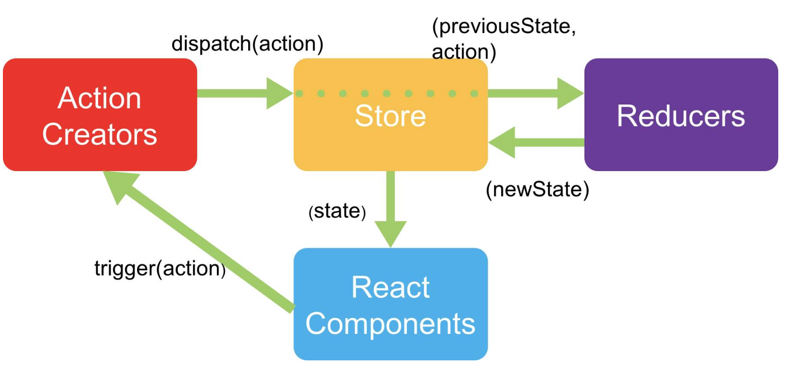

## redux的使用

redux是JavaScript状态容器，提供可预测化的状态管理，本身是一个独立的库，不单单应用于React中, 使用redux可以使状态从组件中脱离出来单独管理。

### redux工作流



1. 需要一个**store**来存储数据，可以通过`createStore`创建

1. 创建时传入自定义的**reducer**，reducer用于初始化state并定义state修改规则
2. **Actions Creators**通过`dispatch`一个action来提交对数据的修改
3. action提交到Reducer后，Reducer根据action的type做相应动作后返回**全新的state**，并不直接修改state
4. 获取state通过`getState`方法
5. **React Components**通过`store.subcribe`订阅状态变更，手动去重新渲染页面

举例如下：

```js
//store/counter.js
import { createStore } from 'redux'

const counterReducer = (state, action) => {
    switch (action.type) {
        case 'add':
            return state + 1
        case 'minus':
            return state - 1
        default:
            // 初始化state值
            return 0
    }
}

const store = createStore(counterReducer)

export default store
```

```jsx
import React, { Component } from 'react'
import store from '../store/counter'

export default class ReduxTest extends Component {
    componentDidMount() {
        // 订阅状态变更
        store.subscribe(() => {
            this.forceUpdate()
        })
    }

    render() {
        return (
            <div>
                { store.getState() }
                <button onClick={() => store.dispatch({ type: 'add'})}> + </button>
                <button onClick={() => store.dispatch({ type: 'minus'})}> - </button>
            </div>
        )
    }
}
```

## react-redux的使用

react的使用比较繁琐：

1. 每次都需要订阅变更状态去手动重新渲染页面
2. 每次都需要通过getState才能获取最新state值
3. 每个组件都需要引入store

所以，将redux整合到react中，需要引入react-redux

### 基本使用

#### 1. 全局提供store

```jsx
// index.js
import React from 'react';
import ReactDOM from 'react-dom';
import './index.css';
import App from './App';
import * as serviceWorker from './serviceWorker';
import { Provider } from 'react-redux'
import store from "./store"

ReactDOM.render(
    <Provider store= { store }>
        <App />
    </Provider>,
    document.getElementById('root')
);
```

#### 2. 获取状态数据

```jsx
// ReactReduxTest.js
import React, { Component } from 'react'
import { connect } from 'react-redux'

@connect(
    state => ({ num: state }), // 状态映射
    {
        add: () => ({ type: 'add' }), // 相当于dispatch({ type: plus }), 必须是一个函数
        minus: () => ({ type: 'minus' })
    }
)
class ReactReduxTest extends Component {
    render() {
        return (
            <div>
                { this.props.num }
                <button onClick={ this.props.add }> + </button>
                <button onClick={ this.props.minus }> - </button>
            </div>
        )
    }
}

export default ReactReduxTest
```

### 异步操作

react只默认支持同步操作，实现异步任务需要中间件的支持， 可以引入`redux-thunk`

#### 1. 在store中引入中间件

```javascript
// store/counter.js
import { createStore, applyMiddleware } from 'redux'
import logger from 'redux-logger'
import thunk from 'redux-thunk'

const store = createStore(counterReducer, applyMiddleware(logger, thunk))
```

#### 2.异步操作的使用

```jsx
// ReactReduxTest.js
@connect(
    state => ({ num: state }), // 状态映射
    {
        asyncAdd: () => dispatch => {
            setTimeout(() => {
                // 异步结束后,手动执行dispatch
                dispatch({ type: 'add' })
            }, 1000)
        }
    }
)
class ReactReduxTest extends Component {
    render() {
        return (
            <div>
                { this.props.num }
                <button onClick={ this.props.asyncAdd }> + </button>
            </div>
        )
    }
}
```

#### 3.代码优化

1. 可以将action抽离到store中

```javascript
//store/counter.js
export const add = num => ({ type: 'add', payload: num })
export const minus = num => ({ type: 'minus', payload: num })
export const asyncAdd = num => dispatch => {
    setTimeout(() => {
        // 异步结束后,手动执行dispatch
        dispatch({ type: 'add', payload: num })
    }, 1000)
}
```

```jsx
// ReactReduxTest.js
@connect(
    state => ({ num: state }), // 状态映射
    {
        add,
        minus,
        asyncAdd
    }
)
class ReactReduxTest extends Component {
    render() {
        return (
            <div>
                { this.props.num }
                <button onClick={ () => this.props.add() }> + </button>
                <button onClick={ () => this.props.minus() }> - </button>
                <button onClick={ () => this.props.asyncAdd() }> + </button>
            </div>
        )
    }
}
```

2. 将reducer从store中抽离到index.js中

```javascript
// store/counter.js
export const counterReducer = (state, action) => {
    const num = action.payload || 1
    switch (action.type) {
        case 'add':
            return state + num
        case 'minus':
            return state - num
        default:
            // 初始化state值
            return 0
    }
}
// store/index.js
import { createStore, applyMiddleware } from 'redux'
import logger from 'redux-logger'
import thunk from 'redux-thunk'
import { counterReducer } from './counter'

const store = createStore(counterReducer, applyMiddleware(logger, thunk))
export default store
```

3. 模块化

通过`combineReducers`使reducer模块化

```javascript
// store/couter.js
import { createStore, applyMiddleware, combineReducers } from 'redux'
import logger from 'redux-logger'
import thunk from 'redux-thunk'
import { counterReducer } from './counter'

const store = createStore(combineReducers({ counter: counterReducer }), applyMiddleware(logger, thunk))
```

```jsx
// ReactReduxTest.js
@connect(
    // state => ({ num: state }), // 状态映射
    state => ({ num: state.counter }), // 模块化
    {
        add,
        minus,
        asyncAdd
    }
```

## Redux原理

### 核心功能实现

```javascript
// my-redux/index.js
export function createStore (reducer, enhancer ) {
    // 存在中间件，包装后返回
    if (enhancer) {
        return enhancer(createStore)(reducer)
    }

    let currentState = undefined
    let listeners = []

    function getState() {
        return currentState
    }

    function dispatch(action) {
        currentState = reducer(currentState, action)
        listeners.forEach(listener => {
            listener()
        })
    }

    function subscribe(listener) {
        listeners.push(listener)
    }
    // 初始化store
    dispatch({ type: '@my-redux init' })

    return { getState, dispatch, subscribe }
}
```

```javascript
// store.js
import { createStore } from './index'

const couterReducer = ( state = 0, action ) => {
    switch (action.type) {
        case 'add':
            return state + 1
        case 'minus':
            return state -1
        default:
            return 0
    }
}

const store = createStore(couterReducer)

export default store
```

```jsx
// MyRedux.js
import React, { Component } from 'react'
import store from './store'

export default class MyReduxTest extends Component {

    componentDidMount() {
        store.subscribe(() => this.forceUpdate())
    }

    render() {
        return (
            <div>
                { store.getState() }
                <button onClick = { () => store.dispatch({ type: 'add' })}> + </button>
                <button onClick = { () => store.dispatch({ type: 'minus' })}> - </button>
            </div>
        )
    }
}
```


### 中间件实现

### redux-thunk原理

## react-redux原理

