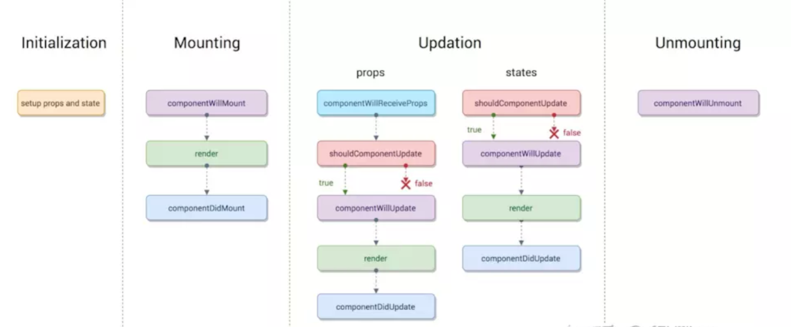
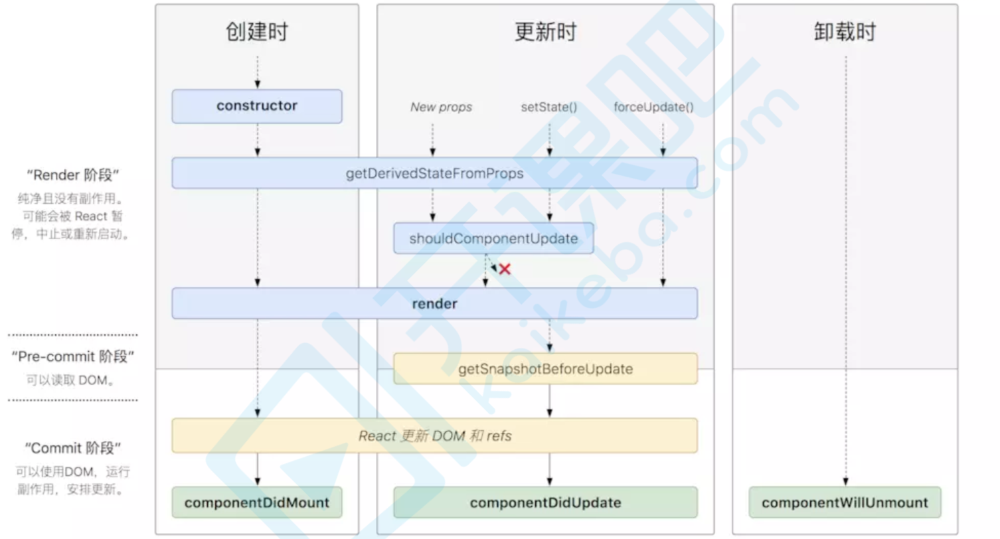

## React 15

分四个阶段：初始化阶段，挂载阶段，更新阶段，销毁阶段



### 初始化阶段

初始化阶段是在`Constructor`中进行，主要是数据的初始化，如：`props`注入到子组件和`state`的初始化

- `constructor` 构造函数

- `getDefaultProps` `props`默认值

- `getInitialState` `state`默认值

### 挂载阶段

挂载阶段负责DOM的挂载，主要包括三个钩子函数：`ComponentWillMount`, `Render`, `ComponentDidMount`

#### ComponentWillMount

在组件挂载到DOM之前调用，只会被调用一次, 在初始化阶段调用`setState`不会引起组件的重新渲染，一般很少使用，因为可以这里的工作提前到`Constructor`中

#### Render

根据组件的Props和state(重传递和重赋值，无论是否变化都会引起组件重新render)，返回一个React元素(JSX), **注意：不负责组件的渲染**，React本身根据返回的元素去渲染页面DOM, render是纯函数，不可以做`setState会改变组件状态。

#### ComponentDidMounted

组件挂载到DOM后后调用，只调用一次

### 更新阶段

更新阶段包括5个钩子函数：`ComponentWillReceiveProps` , `shouldComponentUpdate`, `ComponentWillUpdate`,  `Render`,  `ComponentUpdate`

有两种方式引起组件更新，一是父组件重新渲染，二是组件本身触发`setState`

#### 父组件重新渲染

有两种情况：

1. 父组件直接render导致重传props，可以通过shouldComponentUpdate去做优化，如下：

```jsx
 class Child extends Component {
    shouldComponentUpdate(nextProps){ 
      if(nextProps.someThings === this.props.someThings){
      	return false
    	} 
    }
    render() {
        return <div>{this.props.someThings}</div>
    }
 }
```

2. 在componentWillReceiveProps方法中，将props转换成自己的state 

```jsx
 class Child extends Component {
    constructor(props) {
        super(props);
        this.state = {
            someThings: props.someThings
        };
		}
		componentWillReceiveProps(nextProps) { // 父组件重传props时就会调用这个方法
        this.setState({someThings: nextProps.someThings});
    }
    render() {
        return <div>{this.state.someThings}</div>
		} 
}
```

**注意：**在该函数(componentWillReceiveProps)中调用` this.setState() `将不会引起第二次渲染。 是因为`componentWillReceiveProps`中判断props是否变化了，若变化了，`this.setState`将引起state变化，从而引 起render，此时就没必要再做第二次因重传props引起的render了，不然重复做一样的渲染了。 

#### 组件本身触发setState

```jsx
class Child extends Component {
   constructor(props) {
     super(props);
     this.state = {
       someThings:1
  		} 
   }
  shouldComponentUpdate(nextStates){ // 应该使用这个方法，否则无论state是否有变化都将会导致组件 重新渲染
    if(nextStates.someThings === this.state.someThings){
      return false
  } }
  handleClick = () => { // 虽然调用了setState ，但state并无变化 
    const preSomeThings = this.state.someThings
    this.setState({
      someThings: preSomeThings
  	}) }
  render() {
    return <div onClick = {this.handleClick}>{this.state.someThings}</div>
  } 
}
```

此阶段分为`componentWillReceiveProps，shouldComponentUpdate， componentWillUpdate，render，componentDidUpdate `

##### componentWillReceiveProps(nextProps) 

此方法只调用于props引起的组件更新过程中，参数nextProps是父组件传给当前组件的新props。但父组件render 方法的调用不能保证重传给当前组件的props是有变化的，所以在此方法中根据nextProps和this.props来查明重传 的props是否改变，以及如果改变了要执行啥，比如根据新的props调用this.setState出发当前组件的重新render 

##### shouldComponentUpdate(nextProps, nextState) 

此方法通过比较nextProps，nextState及当前组件的this.props，this.state，返回true时当前组件将继续执行更新 

过程，返回false则当前组件更新停止，以此可用来减少组件的不必要渲染，优化组件性能。 

这边也可以看出，就算componentWillReceiveProps()中执行了this.setState，更新了state，但在render前 (如shouldComponentUpdate，componentWillUpdate)，this.state依然指向更新前的state，不然nextState 及当前组件的this.state的对比就一直是true了。 

##### componentWillUpdate(nextProps, nextState)

此方法在调用render方法前执行，在这边可执行一些组件更新发生前的工作，一般较少用。 

##### render 

render方法在上文讲过，这边只是重新调用。 

##### componentDidUpdate(prevProps, prevState)

此方法在组件更新后被调用，可以操作组件更新的DOM，prevProps和prevState这两个参数指的是组件更新前的 props和state 

### 销毁阶段

组件销毁，可以做一些清除工作，如清除计时器，删除手动创建的组件以免引起内存泄漏此阶段只有一个钩子函数`ComponentWillUnMount`

## React 16.4



### 变更原由

原来(React v16.0前)的生命周期在React v16推出的**Fiber**之后就不合适了，因为如果要开启`async rendering`， 
在render函数之前的所有函数都有可能被执行多次 ,用一个静态函数`getDerivedStateFromProps`来取代其他在render函数之前的 所有函数(`componentWillMount，componentWillReceiveProps，componentWillUpdate`)，也就是强制开发者在 render之前只做无副作用的操作，而且能做的操作局限在根据props和state决定新的state。
所以`React16`新的生命周期弃用了 `componentWillMount、componentWillReceivePorps，componentWillUpdate`新增了 `getDerivedStateFromProps、getSnapshotBeforeUpdate`来代替弃用的三个钩子函数。

### 初始化阶段

- `constructor` 构造函数

- `getDefaultProps` `props`默认值

- `getInitialState` `state`默认值

### 挂载阶段

- `static getDerivedStateFromProps(props,state)`
- `render`
- `componentDidMount`

> `getDerivedStateFromProps`：组件每次被 `rerender`的时候，包括在组件构建之后(虚拟 `dom`之后，实际 `dom`挂载之前)，每次获取新的 `props`或 `state`之后；每次接收新的props之后都会返回一个对象作为新的 `state`，返回null则说明不需要更新 `state`；配合 `componentDidUpdate`，可以覆盖 `componentWillReceiveProps`的所有用法

### 更新阶段

- `static getDerivedStateFromProps(props,state)`
- `shouldComponentUpdate`
- `render`
- `getSnapshotBeforeUpdate(prevProps,prevState)`
  - `componentDidUpdate`

> `getSnapshotBeforeUpdate`：触发时间: `update`发生的时候，在 `render`之后，在组件 `dom`渲染之前；返回一个值，作为 `componentDidUpdate`的第三个参数；配合 `componentDidUpdate`, 可以覆盖 `componentWillUpdate`的所有用法, 它使您的组件可以在可 能更改之前从DOM捕获一些信息(例如滚动位置)。此生命周期返回的任何值都将作为参数传递给 componentDidUpdate()。 

```jsx
class ScrollingList extends React.Component {
 	constructor(props) {
    super(props);
    this.listRef = React.createRef();
  }
  getSnapshotBeforeUpdate(prevProps, prevState) { //我们是否要添加新的 items 到列表?
  // 捕捉滚动位置，以便我们可以稍后调整滚动.
  if (prevProps.list.length < this.props.list.length) {
        const list = this.listRef.current;
        return list.scrollHeight - list.scrollTop;
      }
      return null;
    }
  componentDidUpdate(prevProps, prevState, snapshot) { //如果我们有snapshot值, 我们已经添加了 新的items.
  // 调整滚动以至于这些新的items 不会将旧items推出视图。
  // (这边的snapshot是 getSnapshotBeforeUpdate方法的返回值) 
    if (snapshot !== null) {
        const list = this.listRef.current;
        list.scrollTop = list.scrollHeight - snapshot;
      }
  }
  render() {
    return (
      <div ref={this.listRef}>{/* ...contents... */}</div>
    );
}
```


### 卸载阶段

- `componentWillUnmount`

### 错误处理

- `componentDidCatch`

**注意**：`React16`并没有删除这三个钩子函数，但是不能和新增的钩子函数混用， `React17`将会删除这三个钩子函数，新增了对错误的处理（ `componentDidCatch`）
