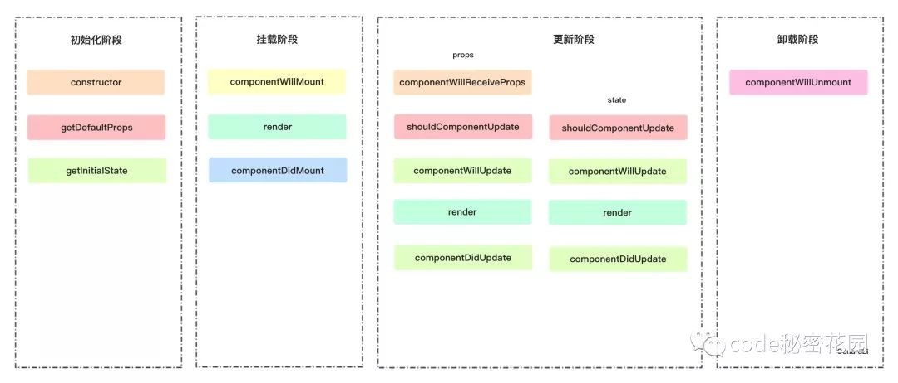
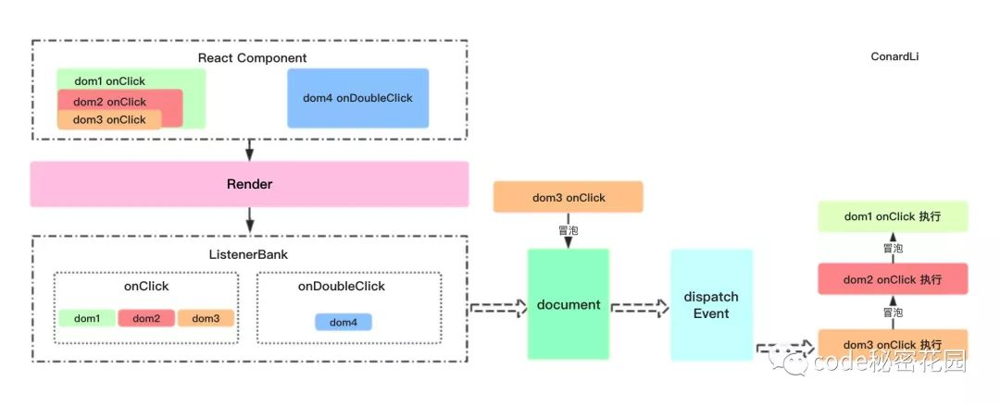
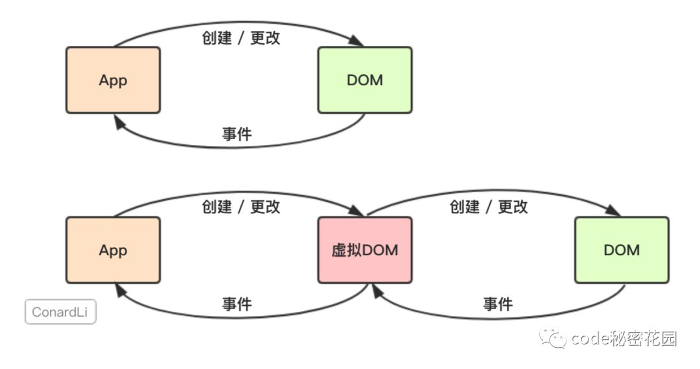
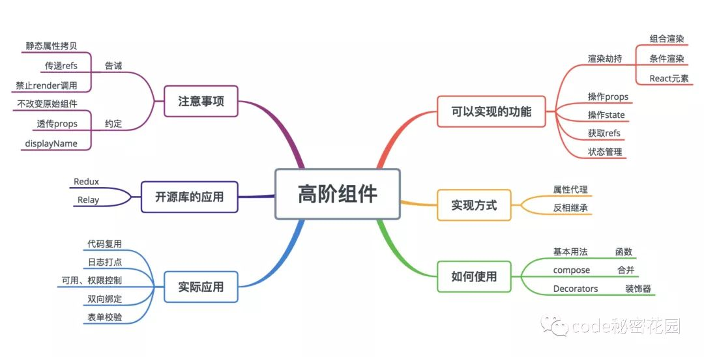

主要讨论以下问题？

`React`生命周期有哪些，16版本生命周期发生了哪些变化？

`setState`是同步的还是异步的？

为什么有时连续多次 `setState`只有一次生效？

`React`如何实现自己的事件机制？

为何 `React`事件要自己绑定 `this`？

原生事件和 `React`事件的区别？

`React`的合成事件是什么？

`React`和原生事件的执行顺序是什么？可以混用吗？

`虚拟Dom`是什么？

`虚拟Dom`比 `普通Dom`更快吗？

`虚拟Dom`中的 `$$typeof`属性的作用是什么？

`React`组件的渲染流程是什么？

为什么代码中一定要引入 `React`？

为什么 `React`组件首字母必须大写？

`React`在渲染 `真实Dom`时做了哪些性能优化？

什么是高阶组件？如何实现？

`HOC`在业务场景中有哪些实际应用场景？

高阶组件( `HOC`)和 `Mixin`的异同点是什么？

`Hook`有哪些优势？

## React生命周期有哪些，16版本生命周期发生了哪些变化？

### 15生命周期



- 初始化阶段

- - `constructor` 构造函数
  - `getDefaultProps` `props`默认值
  - `getInitialState` `state`默认值

- 挂载阶段

- - `componentWillMount` 组件初始化渲染前调用
  - `render` 组件渲染
  - `componentDidMount`组件挂载到 `DOM`后调用

- 更新阶段

- - `componentWillReceiveProps` 组件将要接收新 `props`前调用
  - `shouldComponentUpdate` 组件是否需要更新
  - `componentWillUpdate` 组件更新前调用
  - `render` 组件渲染
  - `componentDidUpdate` 组件更新后调用

- 卸载阶段

- - `componentWillUnmount` 组件卸载前调用

### 16生命周期


- 初始化阶段

- - `constructor` 构造函数
  - `getDefaultProps` `props`默认值
  - `getInitialState` `state`默认值

- 挂载阶段

- - `static getDerivedStateFromProps(props,state)`
  - `render`
  - `componentDidMount`

> `getDerivedStateFromProps`：组件每次被 `rerender`的时候，包括在组件构建之后(虚拟 `dom`之后，实际 `dom`挂载之前)，每次获取新的 `props`或 `state`之后；每次接收新的props之后都会返回一个对象作为新的 `state`，返回null则说明不需要更新 `state`；配合 `componentDidUpdate`，可以覆盖 `componentWillReceiveProps`的所有用法

- 更新阶段

- - `static getDerivedStateFromProps(props,state)`
  - `shouldComponentUpdate`
  - `render`
  - `getSnapshotBeforeUpdate(prevProps,prevState)`
  - `componentDidUpdate`

> `getSnapshotBeforeUpdate`：触发时间: `update`发生的时候，在 `render`之后，在组件 `dom`渲染之前；返回一个值，作为 `componentDidUpdate`的第三个参数；配合 `componentDidUpdate`, 可以覆盖 `componentWillUpdate`的所有用法

- 卸载阶段

- - `componentWillUnmount`

- 错误处理

- - `componentDidCatch`

`React16`新的生命周期弃用了 `componentWillMount、componentWillReceivePorps，componentWillUpdate`新增了 `getDerivedStateFromProps、getSnapshotBeforeUpdate`来代替弃用的三个钩子函数。

> `React16`并没有删除这三个钩子函数，但是不能和新增的钩子函数混用， `React17`将会删除这三个钩子函数，新增了对错误的处理（ `componentDidCatch`）

## setState是同步的还是异步的？

- **生命周期和合成事件中**

在 `React`的生命周期和合成事件中， `React`仍然处于他的更新机制中，这时无论调用多少次 `setState`，都会不会立即执行更新，而是将要更新的·存入 `_pendingStateQueue`，将要更新的组件存入 `dirtyComponent`。

当上一次更新机制执行完毕，以生命周期为例，所有组件，即最顶层组件 `didmount`后会将批处理标志设置为 `false`。这时将取出 `dirtyComponent`中的组件以及 `_pendingStateQueue`中的 `state`进行更新。这样就可以确保组件不会被重新渲染多次。

```js
componentDidMount() {    
  this.setState({      
    index: this.state.index + 1
  })    
  console.log('state', this.state.index);  
}
```

所以，如上面的代码，当我们在执行 `setState`后立即去获取 `state`，这时是获取不到更新后的 `state`的，因为处于 `React`的批处理机制中， `state`被暂存起来，待批处理机制完成之后，统一进行更新。

所以。`setState`本身并不是异步的，而是 `React`的批处理机制给人一种异步的假象。

- **异步代码中**

```js
componentDidMount() {    
  setTimeout(() => {      
    console.log('调用setState');      
    this.setState({        
      index: this.state.index + 1      
    })      
    console.log('state', this.state.index);    
  }, 0);  
}
```

如上面的代码，当我们在异步代码中调用 `setState`时，根据 `JavaScript`的异步机制，会将异步代码先暂存，等所有同步代码执行完毕后在执行，这时 `React`的批处理机制已经走完，处理标志设被设置为 `false`，这时再调用 `setState`即可立即执行更新，拿到更新后的结果。

- **原生事件中**

在原生事件中调用 `setState`并不会触发 `React`的批处理机制，所以立即能拿到最新结果。

- **最佳实践**

`setState`的第二个参数接收一个函数，该函数会在 `React`的批处理机制完成之后调用，所以你想在调用 `setState`后立即获取更新后的值，请在该回调函数中获取。

```js
this.setState({ index: this.state.index + 1 }, () => {      
  console.log(this.state.index);    
})
```

推荐阅读：[由实际问题探究setState的执行机制](http://mp.weixin.qq.com/s?__biz=Mzg2NDAzMjE5NQ==&mid=2247483989&idx=1&sn=d78f889c6e1d7d57058c9c232b1a620e&chksm=ce6ec6f9f9194fef681c79ee869bf58d5413132c73496710b2eb32c859a2249a895c2ce8a7cd&scene=21#wechat_redirect)

为什么有时连续多次setState只有一次生效？

例如下面的代码，两次打印出的结果是相同的：

```js
 componentDidMount() {   
   this.setState({ index: this.state.index + 1 }, () => {   
     console.log(this.state.index);    
   })
   this.setState({ index: this.state.index + 1 }, () => { 
     console.log(this.state.index);    
   })  
 }
```

原因就是 `React`会批处理机制中存储的多个 `setState`进行合并，来看下 `React`源码中的 `_assign`函数，类似于 `Object`的 `assign`：

```js
 _assign(nextState, typeof partial === 'function' ? partial.call(inst, nextState, props, context) : partial);
```

如果传入的是对象，很明显会被合并成一次，所以上面的代码两次打印的结果是相同的：

```js
Object.assign(  nextState,  {index: state.index+ 1},  {index: state.index+ 1})
```

注意， `assign`函数中对函数做了特殊处理，处理第一个参数传入的是函数，函数的参数 `preState`是前一次合并后的结果，所以计算结果是准确的：

```js
componentDidMount() {    
  this.setState((state, props) => ({        
    index: state.index + 1    
  }), () => {      
    console.log(this.state.index);    
  })    
  this.setState((state, props) => ({        
    index: state.index + 1    
  }), () => {      
    console.log(this.state.index);    
  })  
}
```

所以上面的代码两次打印的结果是不同的。

`React`会对多次连续的 `setState`进行合并，如果你想立即使用上次 `setState`后的结果进行下一次 `setState`，可以让 `setState` 接收一个函数而不是一个对象。这个函数用上一个 `state` 作为第一个参数，将此次更新被应用时的 `props` 做为第二个参数。

## React如何实现自己的事件机制？

`React`事件并没有绑定在真实的 `Dom`节点上，而是通过事件代理，在最外层的 `document`上对事件进行统一分发。



组件挂载、更新时：

- 通过 `lastProps`、 `nextProps`判断是否新增和删除事件，分别调用事件注册、卸载方法。
- 调用 `EventPluginHub`的 `enqueuePutListener`进行事件存储
- 获取 `document`对象。
- 根据事件名称（如 `onClick`、 `onCaptureClick`）判断是进行冒泡还是捕获。
- 判断是否存在 `addEventListener`方法，否则使用 `attachEvent`（兼容IE）。
- 给 `document`注册原生事件回调为 `dispatchEvent`(统一的事件分发机制）。

事件初始化：

- `EventPluginHub`负责管理 `React`合成事件的 `callback`，它将 `callback`存储在 `listenerBank`中，另外还存储了负责合成事件的 `Plugin`。
- 获取绑定事件的元素的唯一标识 `key`。
- 将 `callback`根据事件类型，元素的唯一标识 `key`存储在 `listenerBank`中。
- `listenerBank`的结构是： `listenerBank[registrationName][key]`。

触发事件时：

- 触发 `document`注册原生事件的回调 `dispatchEvent`
- 获取到触发这个事件最深一级的元素
- 遍历这个元素的所有父元素，依次对每一级元素进行处理。
- 构造合成事件。
- 将每一级的合成事件存储在 `eventQueue`事件队列中。
- 遍历 `eventQueue`。
- 通过 `isPropagationStopped`判断当前事件是否执行了阻止冒泡方法。
- 如果阻止了冒泡，停止遍历，否则通过 `executeDispatch`执行合成事件。
- 释放处理完成的事件。

> `React`在自己的合成事件中重写了 `stopPropagation`方法，将 `isPropagationStopped`设置为 `true`，然后在遍历每一级事件的过程中根据此遍历判断是否继续执行。这就是 `React`自己实现的冒泡机制。

推荐阅读：[【React深入】React事件机制](http://mp.weixin.qq.com/s?__biz=Mzg2NDAzMjE5NQ==&mid=2247484039&idx=1&sn=1f657356676d4809633f30668acb50d2&chksm=ce6ec62bf9194f3d8a4eb382bd01c56231908a1b08fb9c2c9783f96df6650ee808fe18343032&scene=21#wechat_redirect)

## 为何React事件要自己绑定this？

在上面提到的事件处理流程中， `React`在 `document`上进行统一的事件分发， `dispatchEvent`通过循环调用所有层级的事件来模拟事件冒泡和捕获。

在 `React`源码中，当具体到某一事件处理函数将要调用时，将调用 `invokeGuardedCallback`方法。

```js
function invokeGuardedCallback(name, func, a) {  
  try {    
    func(a);  
  } catch (x) {    
    if (caughtError === null) {      
      caughtError = x;    
    }  
  }
}
```

可见，事件处理函数是直接调用的，并没有指定调用的组件，所以不进行手动绑定的情况下直接获取到的 `this`是不准确的，所以我们需要手动将当前组件绑定到 `this`上。

## 原生事件和React事件的区别？

- `React` 事件使用驼峰命名，而不是全部小写。
- 通过 `JSX` , 你传递一个函数作为事件处理程序，而不是一个字符串。
- 在 `React` 中你不能通过返回 `false` 来阻止默认行为。必须明确调用 `preventDefault`。

## React的合成事件是什么？

`React` 根据 `W3C` 规范定义了每个事件处理函数的参数，即合成事件。

事件处理程序将传递 `SyntheticEvent` 的实例，这是一个跨浏览器原生事件包装器。它具有与浏览器原生事件相同的接口，包括 `stopPropagation()` 和 `preventDefault()`，在所有浏览器中他们工作方式都相同。

`React`合成的 `SyntheticEvent`采用了事件池，这样做可以大大节省内存，而不会频繁的创建和销毁事件对象。

另外，不管在什么浏览器环境下，浏览器会将该事件类型统一创建为合成事件，从而达到了浏览器兼容的目的。

## React和原生事件的执行顺序是什么？可以混用吗？

`React`的所有事件都通过 `document`进行统一分发。当真实 `Dom`触发事件后冒泡到 `document`后才会对 `React`事件进行处理。

所以原生的事件会先执行，然后执行 `React`合成事件，最后执行真正在 `document`上挂载的事件

`React`事件和原生事件最好不要混用。原生事件中如果执行了 `stopPropagation`方法，则会导致其他 `React`事件失效。因为所有元素的事件将无法冒泡到 `document`上，导致所有的 `React`事件都将无法被触发。。

## 虚拟Dom是什么？



在原生的 `JavaScript`程序中，我们直接对 `DOM`进行创建和更改，而 `DOM`元素通过我们监听的事件和我们的应用程序进行通讯。

而 `React`会先将你的代码转换成一个 `JavaScript`对象，然后这个 `JavaScript`对象再转换成真实 `DOM`。这个 `JavaScript`对象就是所谓的虚拟 `DOM`。

当我们需要创建或更新元素时， `React`首先会让这个 `VitrualDom`对象进行创建和更改，然后再将 `VitrualDom`对象渲染成真实DOM。

当我们需要对 `DOM`进行事件监听时，首先对 `VitrualDom`进行事件监听， `VitrualDom`会代理原生的 `DOM`事件从而做出响应。

推荐阅读：[【React深入】深入分析虚拟DOM的渲染过程和特性](http://mp.weixin.qq.com/s?__biz=Mzg2NDAzMjE5NQ==&mid=2247484212&idx=1&sn=e4cf00c0c087c34ae2f181e7b2f2b257&chksm=ce6ec798f9194e8e0ef0327e9a4cbb8d1454218609a20663a5ea5fed9e31f4a39b7fb114e117&scene=21#wechat_redirect)

## 虚拟Dom比普通Dom更快吗？

很多文章说 `VitrualDom`可以提升性能，这一说法实际上是很片面的。

直接操作 `DOM`是非常耗费性能的，这一点毋庸置疑。但是 `React`使用 `VitrualDom`也是无法避免操作 `DOM`的。

如果是首次渲染， `VitrualDom`不具有任何优势，甚至它要进行更多的计算，消耗更多的内存。

`VitrualDom`的优势在于 `React`的 `Diff`算法和批处理策略， `React`在页面更新之前，提前计算好了如何进行更新和渲染 `DOM`。实际上，这个计算过程我们在直接操作 `DOM`时，也是可以自己判断和实现的，但是一定会耗费非常多的精力和时间，而且往往我们自己做的是不如 `React`好的。所以，在这个过程中 `React`帮助我们"提升了性能"。

所以，我更倾向于说， `VitrualDom`帮助我们提高了开发效率，在重复渲染时它帮助我们计算如何更高效的更新，而不是它比 `DOM`操作更快。

## 虚拟Dom中的$$typeof属性的作用是什么？

`ReactElement`中有一个 `$$typeof`属性，它被赋值为 `REACT_ELEMENT_TYPE`：

```
var REACT_ELEMENT_TYPE =  (typeof Symbol === 'function' && Symbol.for && Symbol.for('react.element')) ||  0xeac7;
```

可见， `$$typeof`是一个 `Symbol`类型的变量，这个变量可以防止 `XSS`。

如果你的服务器有一个漏洞，允许用户存储任意 `JSON`对象， 而客户端代码需要一个字符串，这可能会成为一个问题：

```
// JSONlet expectedTextButGotJSON = {  type: 'div',  props: {    dangerouslySetInnerHTML: {      __html: '/* put your exploit here */'    },  },};let message = { text: expectedTextButGotJSON };<p>  {message.text}</p>
```

`JSON`中不能存储 `Symbol`类型的变量。

`ReactElement.isValidElement`函数用来判断一个 `React`组件是否是有效的，下面是它的具体实现。

```
ReactElement.isValidElement = function (object) {  return typeof object === 'object' && object !== null && object.$$typeof === REACT_ELEMENT_TYPE;};
```

可见 `React`渲染时会把没有 `$$typeof`标识，以及规则校验不通过的组件过滤掉。

当你的环境不支持 `Symbol`时， `$$typeof`被赋值为 `0xeac7`，至于为什么， `React`开发者给出了答案：

> `0xeac7`看起来有点像 `React`。

## React组件的渲染流程是什么？

- 使用 `React.createElement`或 `JSX`编写 `React`组件，实际上所有的 `JSX`代码最后都会转换成 `React.createElement(...)`， `Babel`帮助我们完成了这个转换的过程。
- `createElement`函数对 `key`和 `ref`等特殊的 `props`进行处理，并获取 `defaultProps`对默认 `props`进行赋值，并且对传入的孩子节点进行处理，最终构造成一个 `ReactElement`对象（所谓的虚拟 `DOM`）。
- `ReactDOM.render`将生成好的虚拟 `DOM`渲染到指定容器上，其中采用了批处理、事务等机制并且对特定浏览器进行了性能优化，最终转换为真实 `DOM`。

## 为什么代码中一定要引入React？

`JSX`只是为 `React.createElement(component,props,...children)`方法提供的语法糖。

所有的 `JSX`代码最后都会转换成 `React.createElement(...)`， `Babel`帮助我们完成了这个转换的过程。

所以使用了 `JSX`的代码都必须引入 `React`。

## 为什么React组件首字母必须大写？

`babel`在编译时会判断 `JSX`中组件的首字母，当首字母为小写时，其被认定为原生 `DOM`标签， `createElement`的第一个变量被编译为字符串；当首字母为大写时，其被认定为自定义组件， `createElement`的第一个变量被编译为对象；

## React在渲染真实Dom时做了哪些性能优化？

在 `IE（8-11）`和 `Edge`浏览器中，一个一个插入无子孙的节点，效率要远高于插入一整个序列化完整的节点树。

`React`通过 `lazyTree`，在 `IE（8-11）`和 `Edge`中进行单个节点依次渲染节点，而在其他浏览器中则首先将整个大的 `DOM`结构构建好，然后再整体插入容器。

并且，在单独渲染节点时， `React`还考虑了 `fragment`等特殊节点，这些节点则不会一个一个插入渲染。

## 什么是高阶组件？如何实现？

高阶组件可以看作 `React`对装饰模式的一种实现，高阶组件就是一个函数，且该函数接受一个组件作为参数，并返回一个新的组件。

> 高阶组件（ `HOC`）是 `React`中的高级技术，用来重用组件逻辑。但高阶组件本身并不是 `ReactAPI`。它只是一种模式，这种模式是由 `React`自身的组合性质必然产生的。

```
function visible(WrappedComponent) {  return class extends Component {    render() {      const { visible, ...props } = this.props;      if (visible === false) return null;      return <WrappedComponent {...props} />;    }  }}
```

上面的代码就是一个 `HOC`的简单应用，函数接收一个组件作为参数，并返回一个新组件，新组建可以接收一个 `visible props`，根据 `visible`的值来判断是否渲染Visible。



我们可以通过以下两种方式实现高阶组件：

### 属性代理

函数返回一个我们自己定义的组件，然后在 `render`中返回要包裹的组件，这样我们就可以代理所有传入的 `props`，并且决定如何渲染，实际上 ，这种方式生成的高阶组件就是原组件的父组件，上面的函数 `visible`就是一个 `HOC`属性代理的实现方式。

```
function proxyHOC(WrappedComponent) {  return class extends Component {    render() {      return <WrappedComponent {...this.props} />;    }  }}
```

对比原生组件增强的项：

- 可操作所有传入的 `props`
- 可操作组件的生命周期
- 可操作组件的 `static`方法
- 获取 `refs`

### 反向继承

返回一个组件，继承原组件，在 `render`中调用原组件的 `render`。由于继承了原组件，能通过this访问到原组件的 `生命周期、props、state、render`等，相比属性代理它能操作更多的属性。

```
function inheritHOC(WrappedComponent) {  return class extends WrappedComponent {    render() {      return super.render();    }  }}
```

对比原生组件增强的项：

- 可操作所有传入的 `props`
- 可操作组件的生命周期
- 可操作组件的 `static`方法
- 获取 `refs`
- 可操作 `state`
- 可以渲染劫持

推荐阅读：[【React深入】从Mixin到HOC再到Hook](http://mp.weixin.qq.com/s?__biz=Mzg2NDAzMjE5NQ==&mid=2247484193&idx=1&sn=0c152afb3566f2b600b0e218d5d24017&chksm=ce6ec78df9194e9b3e0e4f18706fd84be22f0f84d1e7554892e169a30265c6fa154731c1c7a3&scene=21#wechat_redirect)

## HOC在业务场景中有哪些实际应用场景？

`HOC`可以实现的功能：

- 组合渲染
- 条件渲染
- 操作 `props`
- 获取 `refs`
- 状态管理
- 操作 `state`
- 渲染劫持

`HOC`在业务中的实际应用场景：

- 日志打点
- 权限控制
- 双向绑定
- 表单校验

具体实现请参考我这篇文章：https://juejin.im/post/5cad39b3f265da03502b1c0a

## 高阶组件(HOC)和Mixin的异同点是什么？

`Mixin`和 `HOC`都可以用来解决 `React`的代码复用问题。


图片来源于网络

- `Mixin` 可能会相互依赖，相互耦合，不利于代码维护
- 不同的 `Mixin`中的方法可能会相互冲突
- `Mixin`非常多时，组件是可以感知到的，甚至还要为其做相关处理，这样会给代码造成滚雪球式的复杂性

而 `HOC`的出现可以解决这些问题：

- 高阶组件就是一个没有副作用的纯函数，各个高阶组件不会互相依赖耦合
- 高阶组件也有可能造成冲突，但我们可以在遵守约定的情况下避免这些行为
- 高阶组件并不关心数据使用的方式和原因，而被包裹的组件也不关心数据来自何处。高阶组件的增加不会为原组件增加负担

## Hook有哪些优势？

- 减少状态逻辑复用的风险

`Hook`和 `Mixin`在用法上有一定的相似之处，但是 `Mixin`引入的逻辑和状态是可以相互覆盖的，而多个 `Hook`之间互不影响，这让我们不需要在把一部分精力放在防止避免逻辑复用的冲突上。在不遵守约定的情况下使用 `HOC`也有可能带来一定冲突，比如 `props`覆盖等等，使用 `Hook`则可以避免这些问题。

- 避免地狱式嵌套

大量使用 `HOC`的情况下让我们的代码变得嵌套层级非常深，使用 `HOC`，我们可以实现扁平式的状态逻辑复用，而避免了大量的组件嵌套。

- 让组件更容易理解

在使用 `class`组件构建我们的程序时，他们各自拥有自己的状态，业务逻辑的复杂使这些组件变得越来越庞大，各个生命周期中会调用越来越多的逻辑，越来越难以维护。使用 `Hook`，可以让你更大限度的将公用逻辑抽离，将一个组件分割成更小的函数，而不是强制基于生命周期方法进行分割。

- 使用函数代替class

相比函数，编写一个 `class`可能需要掌握更多的知识，需要注意的点也越多，比如 `this`指向、绑定事件等等。另外，计算机理解一个 `class`比理解一个函数更快。`Hooks`让你可以在 `classes`之外使用更多 `React`的新特性。