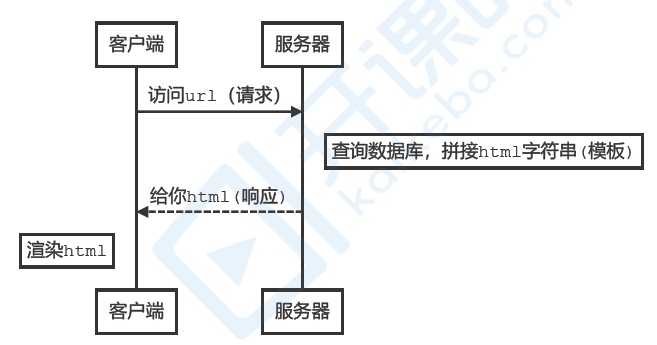
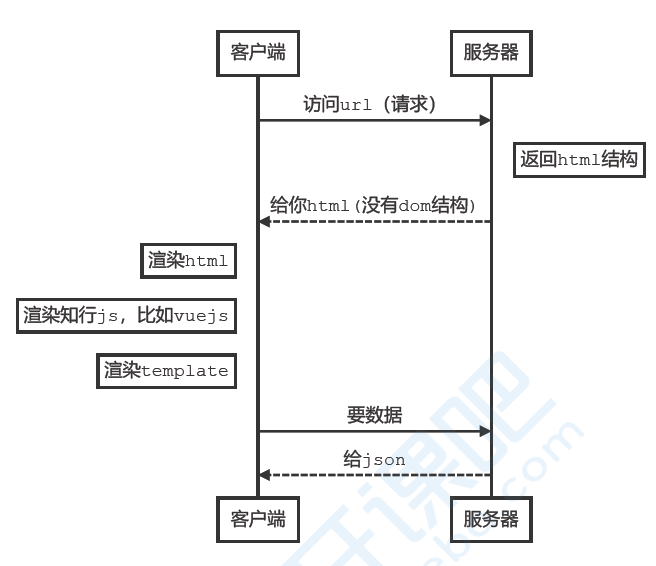
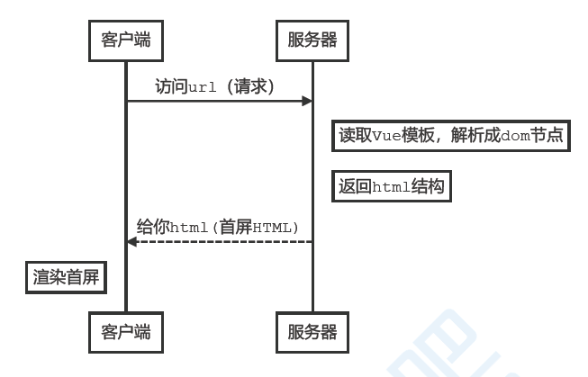
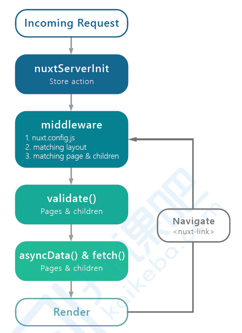
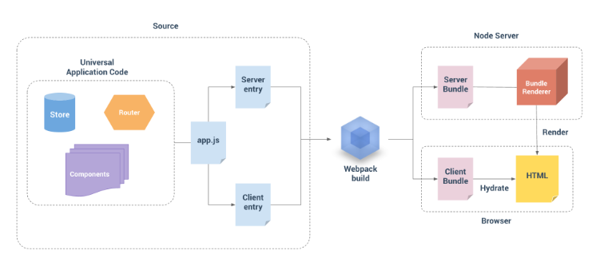

## CSR vs SSR

### 传统的web开发

大致流程如下图：



浏览器拿到的就是全部的DOM结构

**缺点** 是每次切换页面都会发起http请求，切换速度较慢

### SPA

到了vue，react时代，单页应用逐渐成为了主流，页面整体是**JS渲染**出来的，称为CSR，client side render(客户端渲染)。



1. 第一次请求返回的html是不带dom结构的，但会返回很多js文件，比如vuejs。

2. vuejs会把模板在前端渲染出来，此时渲染出来后并没有数据，需要再发起一次请求获取数据

3. 发起第二次请求以获取数据，再填充页面

单页应用有两个问题：

1. **首屏渲染等待时间过长** ：必须等待js加载和执行完毕才能渲染出首屏（注意此时需要两次http请求，第一次请求html，第二次请求json数据）
2. **seo不友好** ：爬虫只能拿到一个空的div，不利于网站seo


### SSR

为了解决单页应用的两个问题，出现了SSR解决方案，后端渲染出完整的首屏dom结构后再返回，前端拿到的内容已经带上首屏，后续的页面操作则用单页的路由跳转和渲染，称为SSR，server side render(服务端渲染)



1. webpack打包生成**Server Bundle**和**Client Bundle**
2. 第一次请求时，通过renderToString将Server Bundle转换成html结构，并将html返回

2. 服务器在返回html的同时会返回**特殊的script标签** (标签中是client Bundle)，首屏打开后会开始下载这些script标签

3. 下载后的会与前端之前返回的静态内容融合**激活** 生成SPA应用

所以SSR其实是结合传统web开发结合SPA的这种优化方案。

**SSR也有缺点** ： 

1. 学习难度比较高
2. 服务器渲染应用程序，需要处于 Node.js server 运行环境
3. 开发条件所限。浏览器特定的代码，只能在某些生命周期钩子函数 (lifecycle hook) 中使用；一些外部扩展库 (external library) 可能需要特殊处理，才能在服务器渲染应用程序中运行
4. 更多的服务器端负载。

## SSR的实现：Nuxt.js

### 什么是nuxt.js

nuxt.js是一个基于vue.js的通用应用框架。

通过对客户端/服务端基础架构的抽象注重，nuxt.js主要关注的是**应用的UI渲染** 。

1. nuxt不仅仅用于服务端渲染也可以用于SPA应用的开发
2. 利用nuxt提供的基础项目结构，路由自动生成，中间件，插件等特性可以大幅度的提供开发效率
3. nuxt可以用于网站静态化

### nuxt渲染流程



**注意**： asyncData是异步请求得到数据后和data融合，fetch一般是获取数据后存入在vuex中

### nuxt安装

```javascript
npx create-nuxt-app projectName
```

**注意**`npx`相当于`npm -g create-nuxt-app` 和 `create-nuxt-app projectName`两个指令，这样做的好处是可以保证每次`create-nuxt-app`都是最新的。

  ### 路由

#### 路由自动生成

pages目录中的所有.vue文件都会自动生成应用的路由配置

#### 导航

路由导航用nuxt-link，作用和router-link等效, 他有多个别名：`n-link`,`NLink`，`NuxtLink`

**注意：** nuxt-link默认会有预加载行为，如果需要禁止的话可以加上`no-prefetch`，大致如下：

```html
<nuxt-link no-prefetch>page not pre-fetched</nuxt-link>
```

#### 动态路由

以下划线作为前缀的.vue文件或目录会定义为动态路由，大致如下面结构

```md
pages/
--| detail/
----| _id.vue
```

**注意：** 如果detail/里面不存在index.vue，:id将作为可选参数

#### 嵌套路由

添加一个与.vue文件同名的目录用来存储子视图组件，大致如下面结构

```md
page/
--| index/
----|_id.vue
--| index.vue
```

使用

```vue
<nuxt-link :to="{name: 'index-id', params: {id: good.id}}"></nuxt-link>
```

### 视图

#### 页面

页面组件就是vue组件，只是nuxt未这些组件添加了一些特殊的配置项如在head()中添加标题，meta等

```javascript
export default {
    head() {
        return {
            title: "课程列表",
            meta: [{ 
                name: "description", 
                hid: "description", 
                content: "set page meta"
            }],
            link: [{ rel: "favicon", href: "favicon.ico" }],
        };
    },
};
```

#### 默认布局页

nuxt的默认布局页在`layouts/default.vue`

#### 自定义布局页

可以在layouts下新建页面，并在想要使用自定义布局中添加，如：

```javascript
export default {
    layout: 'blank'
}
```

#### 自定义错误布局页面

如果为定义错误布局页的话，会有默认的Nuxt布局页面，可以在`layouts`目录下新建`error.vue`页面来自定义。

### 异步数据获取

`asyncData`方法可以使我们可以在设置组件之前异步获取或处理数据，**注意：**

1. 只限于页面组件，比如：component`下的组件是没有此方法的
2. 此时不可以用this
3. nuxt会传递上下文进来
4. nuxt会将组件的asyncData和data方法返回的数据做融合

```javascript
async asyncData({ $axios, params, error }) {// 使用结构
    if (params.id) {
        const { data: goodInfo } = await $axios.$get("/api/detail", { params });
        if (goodInfo) {
            return { goodInfo };
        }
        error({ statusCode: 400, message: "商品详情查询失败" });
    } else {
    	return { goodInfo: null };
    }
}
```

### 中间件

中间件会在一个页面或一组页面渲染之前运行我们定义的函数，常用于权限控制、校验等任务。

范例代码：管理员页面保护，创建middleware/auth.js

```javascript
export default function({ route, redirect, store }) {
    // 上下文中通过store访问vuex中的全局状态
    // 通过vuex中令牌存在与否判断是否登录
    if (!store.state.user.token) {
    	redirect("/login?redirect="+route.path);
    }
}
```

注册中间件，admin.vue

```javascript
<script>
export default {
middleware: ['auth']
}
</script>
```

**全局注册** ，可以通过在nuxt.config.js中全局注册中间件

``` javascript
router: {
    middleware: [auth]
}
```

### 状态管理Vuex

应用根目录下如果存在 store 目录，Nuxt.js将启用vuex状态树。定义各状态树时**具名**导出`state, mutations,
getters, actions`即可,如：用户登录及登录状态保存，创建store/user.js，此时模块名为user

```javascript
export const state = () => ({
	token: ''
});
export const mutations = {
    init(state, token) {
    state.token = token;
}
};
export const getters = {
    isLogin(state) {
    return !!state.token;
}
};
export const actions = {
    login({ commit, getters }, u) {
    	return this.$login(u).then(({ token }) => {
            if (token) {
                commit("SET_TOKEN", token);
            }
            return getters.isLogin;
		});
	}
};
```

### 插件

Nuxt.js会在运行应用之前执行插件函数(**只执行一次**)，需要引入或设置Vue插件、自定义模块和第三方模块时特别有用。例如：

范例代码：接口注入，利用插件机制将服务接口注入组件实例、store实例中，创建plugins/api-inject.js

```javascript
//参数一为上下文，参数二为nuxt提供的inject函数,
export default ({ $axios }, inject) => {
    inject("login", user => {
        return $axios.$post("/api/login", user);
    });
};
```

在`nuxt.config.js`中注册插件

```javascript
plugins: [
	"@/plugins/api-inject"
],
```

使用`this.$login(user)`调用，注意添加$

### nuxtServerInit

通过在store的**根目录的actions**中定义`nuxtServerInit`方法，将**服务端的一些数据传给客户端** ，Nuxt调用它的时候会将页面的上下文对象作为第二个参数传递给它。

nuxtServerInit是在服务端运行的，只运行一次。

例如：登录状态的初始化，store/index.js

```javascript
export const actions = {
    // 第一个参数是action的上下文，第二个参数是页面的上下文
    nuxtServerInit({ commit }, { app }) {
        const token = app.$cookies.get("token");
        if (token) {
            console.log("nuxtServerInit: token:"+token);
            commit("user/SET_TOKEN", token);
        }
    }
};
```

安装依赖模块：`npm i -S cookie-universal-nuxt`

cookie-universal-nuxt可以**无差别(前端，后端)**调用cookies，前端的vue实例中可以拿到后端koa实例中的cookies

注册, nuxt.config.js中`modules: ["cookie-universal-nuxt"],`

### 发布部署

Nuxt.js 提供了两种发布部署应用的方式：服务端渲染应用部署 和 静态应用部署

#### 服务端渲染应用部署

部署 Nuxt.js 服务端渲染的应用不能直接使用 `nuxt` 命令，而应该先进行编译构建，然后再启动 Nuxt 服务，可通过以下两个命令来完成：

```javascript
nuxt build
nuxt start
```


#### 静态应用部署

Nuxt.js 可依据路由配置将应用静态化，使得我们可以将应用部署至任何一个静态站点主机服务商。

可利用下面的命令生成应用的静态目录和文件：

```javascript
npm run generate
```

这个命令会创建一个 `dist` 文件夹，所有静态化后的资源文件均在其中。

如果你的项目需要用到[动态路由](https://zh.nuxtjs.org/guide/routing#动态路由)，请移步 [generate配置API](https://zh.nuxtjs.org/api/configuration-generate) 了解如何让 Nuxt.js 生成此类动态路由的静态文件。

注意：使用 `nuxt generate` 静态化应用的时候, 传给 [asyncData()](https://zh.nuxtjs.org/guide/async-data#asyncdata-方法) 和 [fetch()](https://zh.nuxtjs.org/guide/vuex-store#fetch-方法) 方法的[上下文对象](https://zh.nuxtjs.org/api#上下文对象) 不会包含 `req` 和 `res` 两个属性。

### Vue SSR

服务器渲染的 Vue.js 应用程序也可以被认为是"同构"或"通用"，因为应用程序的大部分代码都可以在**服务器**和**客户端**上运行。

#### vue-server-renderer

后台服务可以通过`vue-server-renderer`的renderToString方法将vue实例转换成html字符串

一个简单的后台服务返回如下：

```javascript
const express = require('express')
const Vue = require('vue')

// express实例
const app = express()

// 创建vue实例
const vm = new Vue({
    data: {
        count: 1
    },
    template: `
        <div>{{ count }}</div>
    `
})

const renderer = require('vue-server-renderer').createRenderer()

app.get('/', async function (req, res) {
    try {
        const html = await renderer.renderToString(vm)
        console.log(html)
        res.send(html)
    } catch (error) {
        res.status(500).send("interal server error")
    }
})

app.listen(3000, () => {
    console.log('服务器启动成功')
})
```

#### 添加vue-router

SPA的页面路由都是通过前端控制的，后端只提供数据，为了方便前后端公用路由数据，我们可以新建router.js对外暴露createRouter**实例工厂**方法，注意每一次url请求应该都返回一个新的路由实例以防止数据互相串改

```javascript
// router/index.js
import Vue from 'vue'
import Router from 'vue-router'

import Index from '@/components/Index'
import Detail from '@/components/Detail'

Vue.use(Router)

// 导出的是Router的实例工厂函数，这也是会加大后台的负载能力
export function createRouter() {
    return new Router({
        mode: 'history',
        routes: [
            {
                path: '',
                component: Index
            },
            {
                path: '/detail',
                component: Detail
            }
        ]
    })
}
```

```vue
// components/Index.vue
<template>
    <div>
        Index Page
    </div>
</template>

<script>
    export default {

    }
</script>

<style lang='scss' scoped>

</style>
```

```vue
// components/Detail.vue
<template>
    <div>
        Detail Page
    </div>
</template>

<script>
    export default {

    }
</script>

<style lang='scss' scoped>

</style>
```

```vue
// app.vue
<template>
  <div id="app">
    <nav>
      <router-link to='/'>首页</router-link>
      <router-link to='/detail'>详情</router-link>
    </nav>
    <router-view></router-view>
  </div>
</template>

<script>

export default {
  name: 'App',
  components: {
  }
}
</script>

<style>
#app {
  font-family: Avenir, Helvetica, Arial, sans-serif;
  -webkit-font-smoothing: antialiased;
  -moz-osx-font-smoothing: grayscale;
  text-align: center;
  color: #2c3e50;
  margin-top: 60px;
}
</style>

```

#### 构建步骤

webpack根据执行环境生成`server bundle`和`client bundle`，对于客户端应用程序和服务器应用程序，我们都要使用webpack打包。

- 通常vue应用程序是由webpack和vue-loader构建，并且许多webpack特定功能不能直接在Node.js中运行。
- 尽管Node.js最新版本能够完全支持ES2015, 我们还是需要转译客户端代码以适应老版的浏览器，这样也会涉及到构建步骤。

所以服务器需要`server bundle`然后用于服务器端渲染(SSR)，而`client bundle`会发送给浏览器，用于混合静态标记。



##### 代码结构

```javascript
src
├── components
│   ├── Index.vue
│   └── Detail.vue
├── App.vue
├── app.js # 通用 entry(universal entry)
├── entry-client.js # 仅运行于浏览器
└── entry-server.js # 仅运行于服务器
```

##### app.js

`app.js` 是我们应用程序的「通用 entry」。在纯客户端应用程序中，我们将在此文件中创建根 Vue 实例，并直接挂载到 DOM。但是，对于服务器端渲染(SSR)，责任转移到纯客户端 entry 文件。`app.js` 简单地使用 export 导出一个 `createApp` 函数：

```javascript
// 通用 entry
import Vue from 'vue'
import App from './App.vue'
import { createRouter } from './router'
import { createStore } from './store'

// 导出一个工厂函数，用于创建新的
// 应用程序、router 和 store 实例
export function createApp(context) {
    const router = createRouter()
    const store = createStore()
    const app = new Vue({
        router,
        store,
        context,
        // 根实例简单的渲染应用程序组件。
        render: h => h(App)
    })

    return { app, router }
}
```

##### entry-client.js

```javascript
import { createApp } from './app'

const { app, router } = createApp()

// 这里假定 App.vue 模板中根元素具有id="app"
router.onReady(() => {
    // 挂载
    app.$mount('#app')
})

```


##### entry-server.js

服务器 entry 使用 default export 导出函数，并在每次渲染中重复调用此函数。


```javascript
import { createApp } from './app'

export default context => {
    // 返回Promise， 确保路由或组件准备就绪
    return new Promise((resolve, reject) => {
        const { app, router } = createApp()
        // 跳转首屏地址
        router.push(context.url)
        // 路由就绪完成Promise
        router.onReady(() => resolve(app), reject)
    })
}
```

##### 构建配置

###### 安装依赖

```javascript
npm install webpack-node-externals lodash.merge -D
```

###### 具体配置, 添加vue.config.js

```javascript
const VueSSRServerPlugin = require("vue-server-renderer/server-plugin");
const VueSSRClientPlugin = require("vue-server-renderer/client-plugin");
const nodeExternals = require("webpack-node-externals");
const merge = require("lodash.merge");
const TARGET_NODE = process.env.WEBPACK_TARGET === "node";
const target = TARGET_NODE ? "server" : "client";
module.exports = {
    css: {
        extract: false
    },
    configureWebpack: () => ({
        // 将 entry 指向应用程序的 server / client 文件
        entry: `./src/entry-${target}.js`,
        // 对 bundle renderer 提供 source map 支持
        devtool: 'source-map',
        target: TARGET_NODE ? "node" : "web",
        node: TARGET_NODE ? undefined : false,
        output: {
            libraryTarget: TARGET_NODE ? "commonjs2" : undefined
        },
        // https://webpack.js.org/configuration/externals/#function
        // https://github.com/liady/webpack-node-externals
        // 外置化应用程序依赖模块。可以使服务器构建速度更快，
        // 并生成较小的 bundle 文件。
        externals: TARGET_NODE
        ? nodeExternals({
            // 不要外置化 webpack 需要处理的依赖模块。
            // 你可以在这里添加更多的文件类型。例如，未处理 *.vue 原始文件，
            // 你还应该将修改 `global`（例如 polyfill）的依赖模块列入白名单
            whitelist: [/\.css$/]
        })
        : undefined,
        optimization: {
            splitChunks: false //这里要设置成false而不是undefined
        },
        plugins: [TARGET_NODE ? new VueSSRServerPlugin() : new VueSSRClientPlugin()]
    }),
    chainWebpack: config => {
        config.module
        .rule("vue")
        .use("vue-loader")
        .tap(options => {
            merge(options, {
                optimizeSSR: false
            });
        });
    }
};
```

###### 修改package.json的启动脚本

```javascript
  "scripts": {
    "build:client": "vue-cli-service build",
    "build:server": "cross-env WEBPACK_TARGET=node vue-cli-service build --mode server",
    "build": "npm run build:server && npm run build:client"
  },
```

注意`build:server`需要做一些改造

1. 指定模式为server，默认为dev
2. 指定`WEBPACK_TARGET=node`
3. 安装`cross-env`，跨平台设置环境变量

###### 准备宿主文件

``` html
<!DOCTYPE html>
<html lang="en">
    <head>
        <meta charset="utf-8">
        <meta http-equiv="X-UA-Compatible" content="IE=edge">
        <meta name="viewport" content="width=device-width,initial-scale=1.0">
        <title>Document</title>
    </head>
    <body>
    <!--vue-ssr-outlet-->
    </body>
</html>
```

###### 修改启动文件

```javascript
const express = require('express')
// const Vue = require('vue')
const fs = require('fs')
// express实例
const app = express()

// 创建vue实例
// const vm = new Vue({
//     data: {
//         count: 1
//     },
//     template: `
//         <div>{{ count }}</div>
//     `
// })

// const renderer = require('vue-server-renderer').createRenderer()
const { createBundleRenderer } = require('vue-server-renderer')

// 服务器bundle文件
const bundle = require('../dist/server/vue-ssr-server-bundle.json')
// 客户端清单文件
const clientManifest = require('../dist/client/vue-ssr-client-manifest.json')

const renderer = createBundleRenderer(bundle, {
    runInNewContext: false,
    template: fs.readFileSync('../src/index.temp.html', 'utf-8'),
    clientManifest
})

function renderToString(context) {
    return new Promise((resolve, reject) => {
        renderer.renderToString(context, (error, html) => {
            if (error) {
                return reject(error)
            }
            resolve(html)
        })
    })
}
app.use(express.static('../dist/client'))
app.get('*', async function (req, res) {
    try {
        // const html = await renderer.renderToString(vm)
        const context = {
            title: 'ssr test',
            url: req.url
        }
        const html = await renderToString(context)
        console.log(html)
        res.send(html)
    } catch (error) {
        res.status(500).send("interal server error")
    }
})

app.listen(3000, () => {
    console.log('服务器启动成功')
})
```

